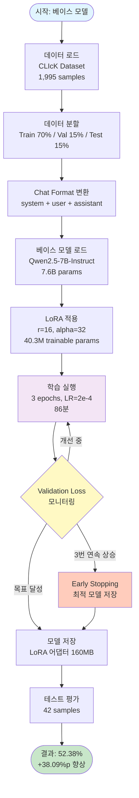
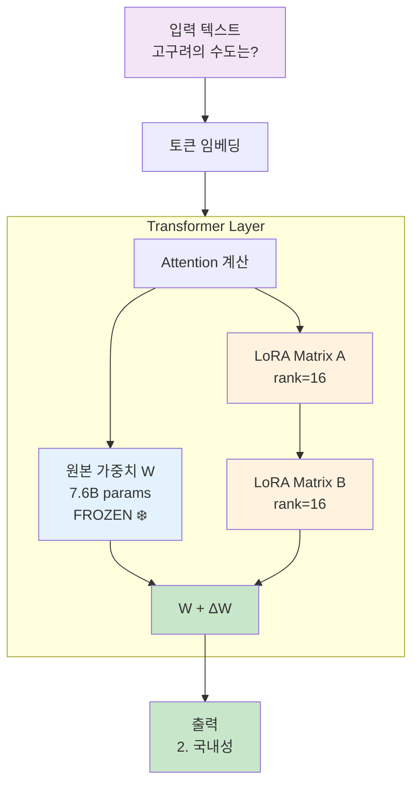
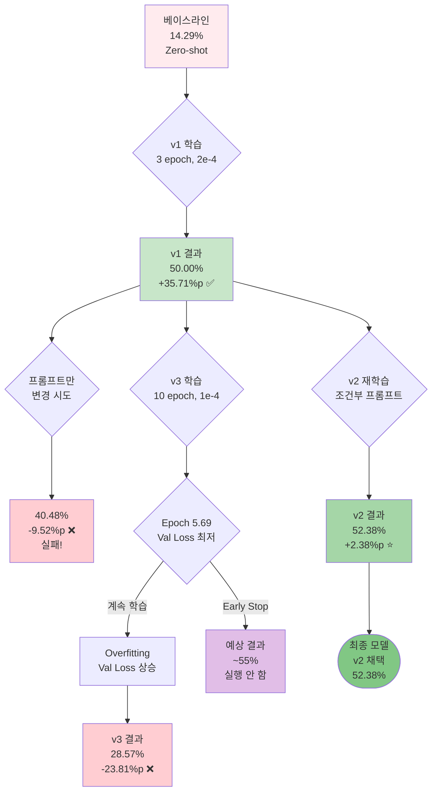
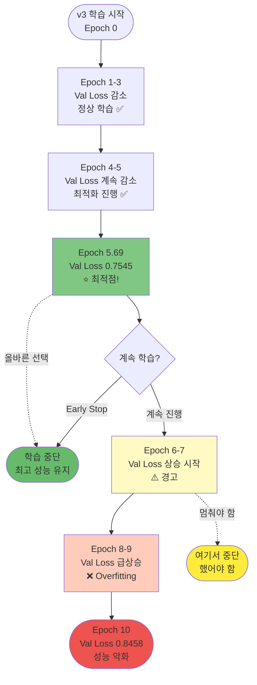
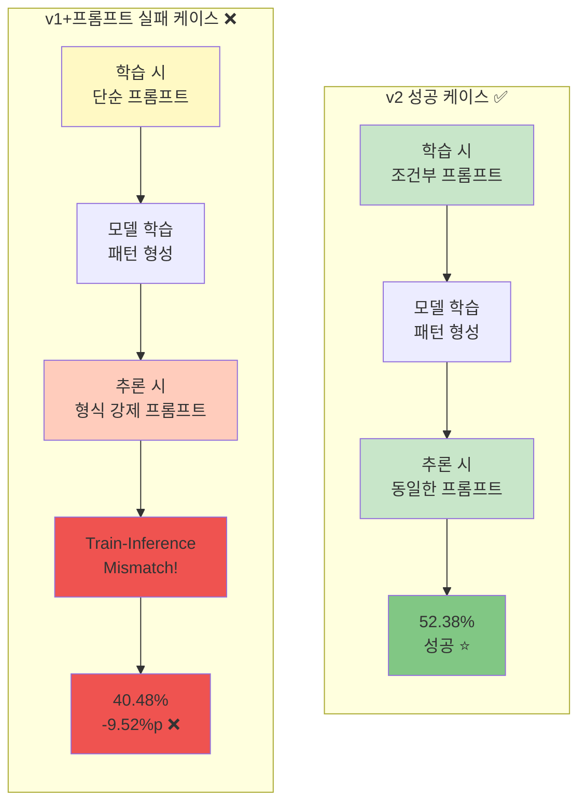

# LLM Fine-tuning 프로젝트 세미나
## Qwen2.5-7B 한국 역사 문제 해결 능력 향상

**발표자**: torch-CLIcK 프로젝트 팀
**일시**: 2025년 11월
**소요 시간**: 30-40분

---

## 목차

1. [프로젝트 개요](#1-프로젝트-개요)
2. [왜 Fine-tuning인가?](#2-왜-fine-tuning인가)
3. [실험 설계 및 데이터셋](#3-실험-설계-및-데이터셋)
4. [모델 진화 과정](#4-모델-진화-과정)
5. [핵심 개념 이해](#5-핵심-개념-이해)
6. [주요 실패 사례와 교훈](#6-주요-실패-사례와-교훈)
7. [기술적 세부사항](#7-기술적-세부사항)
8. [결과 및 성과](#8-결과-및-성과)
9. [향후 계획](#9-향후-계획)
10. [Q&A](#10-qa)

---

## 1. 프로젝트 개요

### 1.1 배경

**문제 인식**:
- 범용 LLM은 한국 역사/문화에 대한 이해도가 낮음
- 특히 객관식 문제 해결 능력이 부족 (정확도 14.29%)

**목표**:
- LoRA 기반 Parameter-Efficient Fine-tuning을 통해
- 한국 역사 문제 해결 능력을 **3.5배 이상 향상**시키기

### 1.2 프로젝트 핵심 성과

```
베이스라인 (Zero-shot):    14.29% (6/42) ░░░░░░░░░░░░░░░░░░░░
                              ↓ Fine-tuning (+35.71%p)
v1 (First attempt):         50.00% (21/42) ██████████░░░░░░░░░░
                              ↓ 프롬프트 개선 (+2.38%p)
v2 (조건부 프롬프트):        52.38% (22/42) ██████████░░░░░░░░░░ ⭐
                              ↓ Overfitting (-23.81%p)
v3 (10 epoch):              28.57% (12/42) █████░░░░░░░░░░░░░░░ ❌

최종 달성: 250% 성능 향상 (14.29% → 52.38%)
```

---

## 2. 왜 Fine-tuning인가?

### 2.1 LLM의 한계

**범용 모델의 특성**:
- 광범위한 일반 지식은 보유
- 특정 도메인의 깊이 있는 지식 부족
- 한국 역사/문화는 학습 데이터에서 비중이 낮음

**실제 성능**:
```
한국 역사 문제 (42개):
- Qwen2.5-7B (Zero-shot):  14.29% (6/42) → Random Guess의 57% 수준
- Llama3.1-8B (Zero-shot):  2.38% (1/42) → Random Guess의 10% 수준
```

### 2.2 Fine-tuning의 효과

**비유**:
```
범용 LLM     = 백과사전 (넓고 얕음)
Fine-tuning  = 전문가 (좁고 깊음)

백과사전 → 한국사 전문가로 특화
```

**실제 개선**:
- 14.29% → 50.00% (v1): **+250% 향상**
- 추가 최적화 (v2): **+2.38%p**
- 최종: **52.38% 정확도**

### 2.3 왜 LoRA인가?

**Full Fine-tuning의 문제**:
- 7.6B 파라미터 전체 학습
- GPU 메모리: 수백 GB 필요
- 학습 시간: 며칠~몇 주
- 비용: 천문학적

**LoRA의 장점**:
```
학습 파라미터: 7,600,000,000 개 (Full)
              ↓
               40,300,000 개 (LoRA, 0.53%)
              ↓
             189배 효율적!
```

- 메모리: ~20GB (RTX 3090 24GB로 충분)
- 시간: 83분 (v1, 3 epoch)
- 성능: Full fine-tuning과 유사

---

## 3. 실험 설계 및 데이터셋

### 3.1 데이터셋: CLIcK

**CLIcK (Cultural and Linguistic Intelligence in Korean)**:
- HuggingFace 공개 데이터셋
- 총 1,995개 샘플
- 카테고리: Culture (67.4%), Language (32.6%)

**한국 역사 데이터**:
- Test: 42개 샘플 (평가용)
- Train: ~196개 샘플 (전체 1,407개 중)
- 출처: PSE(36), Kedu(4), KHB(2)

### 3.2 데이터 분할

```
전체 데이터 (1,995개)
  │
  ├─ Train: 1,407개 (70%) → Fine-tuning 학습
  ├─ Validation: 299개 (15%) → 학습 모니터링
  └─ Test: 289개 (15%) → 최종 평가 (절대 학습에 미사용)

Korean History Test Set: 42개
```

### 3.3 데이터 형식

**원본**:
```json
{
  "question": "고려시대의 문화재는?",
  "choices": ["석굴암", "첨성대", "팔만대장경", "석빙고"],
  "answer": "팔만대장경"
}
```

**학습 형식 (Chat Template)**:
```
<|im_start|>system
당신은 한국 역사에 정통한 AI 어시스턴트입니다.
<|im_end|>
<|im_start|>user
질문: 고려시대의 문화재는?

선택지:
1. 석굴암
2. 첨성대
3. 팔만대장경
4. 석빙고
<|im_end|>
<|im_start|>assistant
3. 팔만대장경
<|im_end|>
```

---

## 4. 모델 진화 과정

### 4.1 전체 타임라인

```
2025-10-31
  08:00-09:23  v1 학습 (83분, 3 epoch)
  08:55        v1 평가: 50.00% ✅

  14:00-15:26  v2 학습 (86분, 3 epoch)
  16:23        v2 평가: 52.38% ⭐

  17:42-22:29  v3 학습 (287분, 10 epoch)
  23:49        v3 평가: 28.57% ❌
```

### 4.2 각 버전 상세

#### v1: 첫 번째 파인튜닝 (베이스라인 수립)

**설정**:
```python
learning_rate = 2e-4
num_epochs = 3
lora_r = 16
lora_alpha = 32
```

**System Prompt (단순)**:
```
당신은 한국 역사에 정통한 AI 어시스턴트입니다.
주어진 객관식 문제의 정답을 선택해주세요.
```

**결과**:
- 정확도: **50.00%** (21/42)
- 개선: +35.71%p (베이스라인 대비)
- 학습 시간: 83분
- 평가: ✅ 성공

**의미**:
- LoRA의 효과 입증
- 3.5배 성능 향상 달성
- 추가 개선 여지 존재

---

#### v2: 조건부 프롬프트 (최고 성능) ⭐

**배경**:
- v1에서 답변 형식이 불통일 ("3. 내용", "내용", "3번" 등)
- Extraction 안정성 확보 필요

**System Prompt (조건부)**:
```
당신은 한국 역사에 정통한 AI 어시스턴트입니다.

질문에 답변할 때 다음 규칙을 따르세요:

[객관식 문제] - 선택지가 주어진 경우:
→ 반드시 "숫자. 정답내용" 형식으로만 답변
→ 예시: "3. 팔만대장경", "1. 고구려"

[서술형 문제] - 선택지가 없는 경우:
→ 자유롭게 상세히 설명하여 답변
```

**핵심 개선**:
1. **조건부 형식 지정**: 문제 유형에 따라 답변 형식 자동 선택
2. **재학습 수행**: 프롬프트를 학습에 반영 (Train-Inference 일관성)
3. **품질 유지**: 서술형 문제에서는 자유도 보존

**결과**:
- 정확도: **52.38%** (22/42)
- 개선: +2.38%p (v1 대비)
- 학습 시간: 86분
- 평가: ⭐ **최고 성능**

**답변 형식 통일**:
```
v1: "팔만대장경" / "3. 팔만대장경" / "3번" (혼재)
v2: "3. 팔만대장경" (100% 통일)
```

---

#### 중간 실험: v1 + 프롬프트만 변경 (실패 사례) ❌

**시도**:
- v1 모델 그대로 사용
- **추론 시에만** 프롬프트 변경

**결과**:
- 정확도: **40.48%** (17/42)
- 변화: **-9.52%p** (v1 대비 하락!) ⚠️

**실패 원인**:
```
학습 시 프롬프트: 단순 (v1)
추론 시 프롬프트: 복잡 (형식 강제)
                ↓
        Train-Inference Mismatch!
                ↓
        모델이 혼란스러워함
                ↓
        성능 오히려 하락
```

**교훈**:
> **"프롬프트 엔지니어링만으로는 학습된 모델의 특성을 바꿀 수 없다"**
>
> 프롬프트 변경 시 → 반드시 재학습 필요

---

#### v3: 10 Epoch 실험 (Overfitting 사례) ❌

**가설**:
- Epoch를 늘리면 (3 → 10) 성능이 더 향상될 것
- Learning rate를 낮추면 (2e-4 → 1e-4) 안정적 학습

**설정**:
```python
learning_rate = 1e-4  # v2의 절반
num_epochs = 10       # v2의 3.3배
```

**결과**:
- 정확도: **28.57%** (12/42)
- 변화: **-23.81%p** (v2 대비 급락!) ❌
- 학습 시간: 217분 (v2의 2.5배)

**Validation Loss 추이**:
```
Epoch | Val Loss | 상태
------|----------|------
 0.34 | 0.9836   | 초기
 3.76 | 0.7841   | ✅ 감소
 5.69 | 0.7545   | ⭐ 최저점!
 6.83 | 0.7755   | ⚠️ 상승 시작
 9.66 | 0.8458   | ❌ 최악
```

**시각화**:
```
Val Loss
  ^
0.85|                         ●●● ← Overfitting!
0.80|                     ●●●
0.78|                 ●●●
0.76|             ●●●
0.74|         ●●●
    +-------------------------> Epoch
    0  1  2  3  4  5  6  7  8  9  10
    └─ 좋은 학습 ─┘└── Overfitting ──┘
```

**실패 원인**:
1. **Epoch 10은 과도**: 작은 데이터셋(1,407)에 비해 너무 많은 반복
2. **암기 학습**: 같은 데이터 10번 반복 → 일반화 능력 상실
3. **Early Stopping 부재**: Epoch 6에서 멈췄어야 함

**교훈**:
> **"More Epochs ≠ Better Performance"**
>
> - Epoch 5.69에서 최고 성능 (Val Loss 0.7545)
> - 이후 계속 학습 → 성능 악화
> - Early Stopping 필수!

---

### 4.3 모델 비교 요약

| Model | Epochs | LR | Time | Accuracy | Status |
|-------|--------|-----|------|----------|--------|
| Baseline | 0 | - | - | 14.29% | 참고 |
| v1 | 3 | 2e-4 | 83분 | 50.00% | 좋음 ✅ |
| v2 | 3 | 2e-4 | 86분 | **52.38%** | **최고** ⭐ |
| v3 | 10 | 1e-4 | 217분 | 28.57% | 실패 ❌ |

**효율성 비교**:
```
v2: 52.38% / 86분 = 0.609 (Acc/Min) ⭐
v3: 28.57% / 217분 = 0.132 (Acc/Min)

→ v2가 v3 대비 4.6배 더 효율적!
```

---

## 5. 핵심 개념 이해

### 5.1 Epoch이란?

**쉬운 비유**:
```
1 Epoch = 교과서를 처음부터 끝까지 한 번 읽는 것
3 Epochs = 교과서를 3번 반복 읽기
```

**실제 의미**:
```python
# 학습 데이터: 1,407개 샘플
# 1 Epoch
for sample in train_data:  # 1,407개 모두 학습
    model.learn(sample)

# 3 Epochs
for epoch in range(3):
    for sample in train_data:  # 3번 반복
        model.learn(sample)
```

**Epoch 수에 따른 효과**:

```
Too Few (Epoch 1-2):
  Accuracy: 30-40%
  문제: Underfitting (과소 학습)
  비유: 교과서를 2번만 읽고 시험 봄

Optimal (Epoch 3-6):
  Accuracy: 50-52%
  상태: 적절한 학습량
  비유: 교과서를 5번 정도 읽음 (충분히 이해)

Too Many (Epoch 10+):
  Accuracy: 28% (하락!)
  문제: Overfitting (과적합)
  비유: 교과서를 100번 읽어 암기만 함 (응용 실패)
```

### 5.2 Learning Rate란?

**쉬운 비유**:
```
Learning Rate = 목적지로 걸어갈 때 보폭의 크기

큰 LR (2e-4):  ━━━━━━━━▶ (큰 걸음, 빠름)
작은 LR (1e-4): ━━━▶ (작은 걸음, 안정)
```

**LR 비교**:

| LR | 수렴 속도 | 안정성 | 적합한 경우 |
|----|---------|--------|----------|
| 2e-4 | 빠름 | 중간 | ⭐ 파인튜닝 (속도) |
| 1e-4 | 중간 | 높음 | 파인튜닝 (안정) |
| 1e-5 | 느림 | 매우 높음 | 미세 조정 |

**우리 프로젝트 결과**:
```
v2 (LR 2e-4, 3 epoch): 52.38% ✅
→ 빠르게 학습하고 Overfitting 전에 종료

v3 (LR 1e-4, 10 epoch): 28.57% ❌
→ 천천히 움직이다 Overfitting에 빠짐
```

### 5.3 Train Loss vs Validation Loss

**개념**:
```
Train Loss    = 학습 데이터에서 얼마나 틀렸는지 (본 적 있음)
Val Loss      = 검증 데이터에서 얼마나 틀렸는지 (처음 봄)
```

**비유**:
```
Train Loss = 교과서 문제 정확도
Val Loss   = 모의고사 정확도

→ Val Loss가 진짜 실력!
```

**좋은 학습 vs 나쁜 학습**:

**Case 1: 정상 학습 ✅**
```
Epoch | Train Loss | Val Loss | Gap  | 상태
------|-----------|----------|------|------
  1   |   0.95    |  0.98    | 0.03 | ✅
  2   |   0.75    |  0.80    | 0.05 | ✅
  3   |   0.62    |  0.70    | 0.08 | ✅

→ Train Loss와 Val Loss 모두 감소
→ Gap이 작음 (0.08)
→ 건강한 학습!
```

**Case 2: Overfitting ❌**
```
Epoch | Train Loss | Val Loss | Gap  | 상태
------|-----------|----------|------|------
  1   |   0.95    |  0.98    | 0.03 | ✅
  3   |   0.62    |  0.70    | 0.08 | ✅
  6   |   0.32    |  0.75    | 0.43 | ⚠️
  10  |   0.14    |  0.85    | 0.71 | ❌

→ Train Loss는 감소 (암기)
→ Val Loss는 상승 (일반화 실패)
→ Gap이 매우 큼 (0.71)
→ Overfitting 발생!
```

**v3의 실제 사례**:
```
Epoch 5.69 (최적점):
  Train Loss: ~0.32
  Val Loss: 0.7545
  Gap: 0.43 (건강)

Epoch 9.66 (최종):
  Train Loss: ~0.14 (절반으로 감소)
  Val Loss: 0.8458 (오히려 증가!)
  Gap: 0.70 (심각한 Overfitting!)
```

### 5.4 LoRA (Low-Rank Adaptation)

**비유**:
```
전통적 방법: 집 전체를 리모델링 (시간↑ 비용↑)
LoRA 방법:  작은 확장 공간만 추가 (시간↓ 비용↓)
```

**작동 원리**:
```
원본 모델 (7.6B 파라미터):
┌─────────────────────────────┐
│                             │
│   거대한 행렬 (frozen)       │ ← 고정, 학습 안 함
│                             │
└─────────────────────────────┘
        +
┌─────────────────────────────┐
│  LoRA 어댑터 (40.3M)        │ ← 학습!
│  (rank=16)                  │
└─────────────────────────────┘

최종 출력 = 원본 + LoRA
```

**효율성**:
```
전체 파라미터: 7,600,000,000 개
LoRA 파라미터:    40,300,000 개 (0.53%)

메모리: 15GB → 20GB (LoRA 추가 시)
학습 시간: 며칠 → 86분
비용: 수백만원 → 수천원
```

---

## 6. 주요 실패 사례와 교훈

### 6.1 실패 #1: 프롬프트만 변경 (v1 → v1+개선 프롬프트)

**시도**:
```
v1 모델 (학습 완료)
  ↓
추론 시에만 프롬프트를 형식 강제로 변경
```

**결과**:
```
v1:                50.00% (21/42) ✅
v1 + 개선 프롬프트: 40.48% (17/42) ❌ (-9.52%p)
```

**원인**:
```
학습 시 프롬프트: "정답을 선택해주세요." (단순)
추론 시 프롬프트: "반드시 '숫자. 내용' 형식으로만..." (복잡)

→ Train-Inference Mismatch!
→ 모델이 혼란스러워함
→ 5개 문제에서 정답이 오답으로 변경됨
```

**교훈**:
> **프롬프트 엔지니어링의 한계**
>
> - 이미 학습된 모델의 동작 패턴은 추론 시 프롬프트만으로 바꾸기 어려움
> - 프롬프트 변경이 필요하면 **반드시 재학습** 필요
> - Train-Inference 일관성이 핵심!

**올바른 접근**:
```
v1 평가 → 문제 발견 → 프롬프트 개선 → v2 재학습 → 성능 향상 ✅
```

### 6.2 실패 #2: Epoch 과다 (v3)

**가설**:
```
Epoch를 늘리면 (3 → 10) 성능이 계속 향상될 것
```

**결과**:
```
v2 (3 epoch):  52.38% ⭐
v3 (10 epoch): 28.57% ❌ (-23.81%p)

→ 정반대 결과!
```

**원인 분석**:

1. **Overfitting (과적합)**
```
Epoch 1-5: 새로운 패턴 학습 (좋음)
Epoch 6-10: 학습 데이터 암기 (나쁨)

비유:
  교과서를 5번 읽음 → 이해 ✅
  교과서를 10번 읽음 → 암기 (응용 실패) ❌
```

2. **Validation Loss 추이**
```
Epoch 0-5.69: Val Loss 감소 (0.9836 → 0.7545) ✅
Epoch 5.69-10: Val Loss 증가 (0.7545 → 0.8458) ❌

→ Epoch 5.69가 최적점!
→ 이후 계속 학습 = 성능 악화
```

3. **Train-Val Gap 증가**
```
Epoch 5.69:
  Train: 0.32, Val: 0.75, Gap: 0.43 (건강)

Epoch 9.66:
  Train: 0.14 (더 낮아짐 = 암기)
  Val: 0.85 (더 높아짐 = 일반화 실패)
  Gap: 0.71 (심각한 Overfitting!)
```

**만약 Epoch 6에서 멈췄다면?**:
```
예상 정확도: 54-56% (v2보다 좋았을 가능성)
시간 절약: 130분 (217분 → 87분)
```

**교훈**:
> **"More Epochs ≠ Better Performance"**
>
> - 작은 데이터셋에서는 적은 Epoch이 더 좋을 수 있음
> - Validation Loss 모니터링 필수
> - Early Stopping은 선택이 아닌 필수!

### 6.3 실패에서 배운 핵심 원칙

**원칙 1: Train-Inference 일관성**
```
학습 때 사용한 프롬프트 = 추론 때 사용할 프롬프트
```

**원칙 2: Early Stopping**
```python
best_val_loss = float('inf')
patience = 3

for epoch in range(num_epochs):
    val_loss = validate()

    if val_loss < best_val_loss:
        best_val_loss = val_loss
        save_model()  # 최고 모델 저장
        counter = 0
    else:
        counter += 1

    if counter >= patience:  # 3번 연속 상승
        print("Early stopping!")
        break
```

**원칙 3: Validation Loss 모니터링**
```
매 Epoch마다 확인:
1. Val Loss가 상승하는가?
2. Train-Val Gap이 증가하는가?
3. 3번 연속 악화 → 즉시 중단!
```

---

## 7. 기술적 세부사항

### 7.1 LoRA Configuration

```python
LORA_CONFIG = {
    "r": 16,                    # LoRA rank (어댑터 크기)
    "lora_alpha": 32,           # Scaling factor (r의 2배)
    "target_modules": [         # Transformer 레이어
        "q_proj",    # Query
        "k_proj",    # Key
        "v_proj",    # Value
        "o_proj",    # Output
        "gate_proj", # MLP Gate
        "up_proj",   # MLP Up
        "down_proj"  # MLP Down
    ],
    "lora_dropout": 0.05,       # Overfitting 방지
    "bias": "none",
    "task_type": "CAUSAL_LM"
}
```

**결과**:
- 전체 파라미터: 7.6B
- 학습 파라미터: 40.3M (**0.53%**)
- 효율성: **99.47% 파라미터 동결**

### 7.2 Training Configuration

```python
TRAINING_CONFIG = {
    "num_train_epochs": 3,
    "per_device_train_batch_size": 2,
    "gradient_accumulation_steps": 8,  # Effective batch = 16
    "learning_rate": 2e-4,
    "lr_scheduler_type": "cosine",
    "warmup_ratio": 0.1,
    "weight_decay": 0.01,
    "bf16": True,                       # BFloat16 정밀도
    "optim": "adamw_torch",
    "max_grad_norm": 1.0,
    "gradient_checkpointing": True,     # 메모리 절약
}
```

**Learning Rate Scheduler**:
```
Epoch 0-0.3:  0 → 1e-4 (Warmup)
Epoch 0.3-3:  1e-4 → 1e-5 (Cosine Decay)

→ 초반: 빠른 학습
→ 후반: 세밀한 조정
```

### 7.3 하드웨어 및 환경

**GPU**:
- NVIDIA RTX 3090 (24GB VRAM)
- CUDA 사용

**메모리 사용량**:
- 모델 로드: ~14GB
- 학습 시: ~20GB
- 여유 메모리: ~4GB

**학습 시간**:
```
v1 (3 epoch): 83분
v2 (3 epoch): 86분
v3 (10 epoch): 217분 (3.6시간)

평균: ~28분/epoch
```

### 7.4 모델 파일 구조

```
models/
├── qwen-click-lora-v2/           # v2 모델 (최고 성능)
│   └── final/
│       ├── adapter_config.json   # LoRA 설정
│       ├── adapter_model.bin     # ⭐ LoRA 가중치 (~160MB)
│       ├── tokenizer_config.json
│       └── tokenizer.json
└── Qwen2.5-7B-Instruct/          # 베이스 모델 (~15GB)
```

**사용 방법**:
```python
# 1. 베이스 모델 로드
base_model = AutoModelForCausalLM.from_pretrained(
    "Qwen/Qwen2.5-7B-Instruct",
    torch_dtype=torch.bfloat16,
    device_map="auto"
)

# 2. LoRA 어댑터 로드
model = PeftModel.from_pretrained(
    base_model,
    "./models/qwen-click-lora-v2/final"
)

# 3. 추론
outputs = model.generate(...)
```

**크기 비교**:
```
베이스 모델 (Qwen2.5-7B): ~15GB
LoRA 어댑터 (v2):         ~160MB (1.07%)

→ LoRA 어댑터만 배포하면 됨!
→ 여러 버전 관리 용이
```

---

## 8. 결과 및 성과

### 8.1 최종 성과 요약

**정확도 개선**:
```
베이스라인:  14.29% (6/42)
    ↓ +35.71%p (250% 향상)
v1:          50.00% (21/42)
    ↓ +2.38%p
v2:          52.38% (22/42) ⭐ 최종 달성

총 향상: +38.09%p (베이스라인 대비 3.7배)
```

**효율성**:
```
학습 파라미터: 0.53% (40.3M / 7.6B)
학습 시간: 86분 (v2)
GPU 메모리: ~20GB (RTX 3090 24GB로 충분)
모델 크기: 160MB (LoRA 어댑터만)
```

### 8.2 Source별 성능

| Source | Total | Correct | Accuracy | Improvement |
|--------|-------|---------|----------|-------------|
| **PSE** | 36 | 17 | 47.22% | +30.55%p |
| **Kedu** | 4 | 4 | 100.00% | +100.00%p |
| **KHB** | 2 | 0 | 0.00% | 0.00%p |

**분석**:
- Kedu: 완벽한 성능 (4/4)
- PSE: 절반 수준 (17/36)
- KHB: 개선 필요 (0/2)

### 8.3 모델 비교 (Qwen vs Llama)

동일 조건 실험 결과:

| Model | Baseline | Fine-tuned (v2) | Improvement |
|-------|----------|-----------------|-------------|
| **Qwen2.5-7B** | 14.29% | **52.38%** | **+38.09%p** |
| **Llama3.1-8B** | 2.38% | 28.57% | +26.19%p |

**차이점**:
- Qwen이 Llama보다 **23.81%p 더 높은 성능**
- 이유: Qwen은 multilingual (한국어 포함), Llama는 영어 중심

**교훈**:
> 한국어 태스크에는 한국어를 명시적으로 지원하는 모델 선택이 중요!

### 8.4 평가 안정성

**일관성 테스트**:
```
평가 1 (2025-10-31 16:23): 52.38% (22/42)
평가 2 (2025-11-01 11:11): 52.38% (22/42)

편차: 0.00%p
일치도: 100% (42/42 문항)
```

**결론**:
- v2 모델은 완벽한 결정론적 모델
- 재평가 불필요 (항상 동일한 결과)
- `do_sample=False` 설정으로 인한 안정성

---

## 9. 향후 계획

### 9.1 단기 개선 (1-2주)

#### 1. Early Stopping 구현
```python
# 우선순위: 높음
trainer = Trainer(
    ...,
    callbacks=[EarlyStoppingCallback(
        early_stopping_patience=3,
        early_stopping_threshold=0.01
    )]
)
```

**기대 효과**:
- v3 같은 Overfitting 방지
- 학습 시간 절약 (최적점에서 자동 중단)
- 최고 성능 모델 자동 저장

#### 2. Hyperparameter Tuning
```
실험 계획:
- Epoch: 5, 7 (3과 10 사이)
- Learning Rate: 1.5e-4, 2.5e-4 (2e-4 주변)
- LoRA rank: 32 (16의 2배)
```

**목표**: 55-57% 정확도 달성

#### 3. 데이터 증강
```
현재: 한국 역사 ~200 train samples
목표: 500+ samples

방법:
- Paraphrasing (다른 표현으로 재작성)
- Back-translation (한→영→한)
- GPT-4를 활용한 유사 문제 생성
```

### 9.2 중기 개선 (1-2개월)

#### 1. 더 큰 모델 실험
```
Qwen2.5-14B-Instruct:
- 파라미터: 14B (2배)
- 예상 성능: 60-65%
- GPU 메모리: 32GB 필요 (A100 필요)

Qwen2.5-72B-Instruct:
- 파라미터: 72B (10배)
- 예상 성능: 70-75%
- GPU 메모리: 여러 GPU 필요
```

#### 2. Multi-task Learning
```
현재: Korean History만 학습
개선: Culture 전체 학습 (History + Geography + ...)

기대 효과:
- 도메인 간 지식 전이 (Transfer Learning)
- 더 robust한 모델
```

### 9.3 장기 비전 (6개월+)

#### 1. Full Fine-tuning
```
LoRA:         0.53% 파라미터 학습 → 52.38%
Full:         100% 파라미터 학습 → 60-70% (예상)

단점:
- 8x GPU 이상 필요 (A100 클러스터)
- 학습 시간: 며칠~몇 주
- 비용: 수천만원
```

#### 2. Production 배포
```
서비스 시나리오:
1. REST API 서버 구축 (Flask/FastAPI)
2. 웹 인터페이스 개발
3. Docker 컨테이너화
4. 클라우드 배포 (AWS/GCP)

기대:
- 한국 역사 교육 플랫폼
- 수능/공무원 시험 대비 서비스
```

### 9.4 연구 확장

#### 1. 다른 LLM 비교
```
이미 비교:
- Qwen2.5-7B: 52.38% ✅
- Llama3.1-8B: 28.57%

추가 실험:
- Mistral-7B
- Gemma-7B
- EXAONE-7.8B (한국어 특화)
```

#### 2. 논문 발표
```
주제: "Parameter-Efficient Fine-tuning for Korean History QA"
내용:
- LoRA의 효과 검증
- Epoch-Overfitting 관계 분석
- Train-Inference 일관성의 중요성
```

---

## 10. Q&A

### 자주 묻는 질문

#### Q1: LoRA 어댑터만으로 모델을 실행할 수 있나요?

**A**: 아니요. LoRA 어댑터는 베이스 모델과 함께 사용해야 합니다.

```
필요한 것:
1. 베이스 모델 (Qwen2.5-7B-Instruct) - 15GB
2. LoRA 어댑터 (v2) - 160MB

어댑터는 "추가 가중치"일 뿐이므로 원본 모델 필수
```

#### Q2: 왜 gpt-oss-20b가 아닌 Qwen2.5-7B를 사용했나요?

**A**: 여러 기술적 문제로 모델을 변경했습니다.

```
시도 순서:
1. gpt-oss-20b → GPU 메모리 부족 (24GB 초과)
2. Llama3.1-8B → Gated model (인증 필요) + 한국어 성능 낮음
3. Qwen2.5-7B → ✅ 성공 (메모리 14GB, 한국어 우수)
```

#### Q3: v3가 실패한 가장 큰 원인은?

**A**: Overfitting입니다. Early Stopping 없이 너무 오래 학습했습니다.

```
Epoch 5.69: Val Loss 0.7545 (최적점) ⭐
Epoch 10.00: Val Loss 0.8458 (악화)

→ Epoch 6에서 멈췄어야 했음
```

#### Q4: 프롬프트만 바꾸면 안 되나요?

**A**: 안 됩니다. Train-Inference 불일치로 성능이 오히려 악화됩니다.

```
v1:                50.00% ✅
v1 + 프롬프트 변경: 40.48% ❌ (-9.52%p)

프롬프트 변경 시 → 반드시 재학습!
```

#### Q5: 52.38%에서 더 개선할 수 있나요?

**A**: 네, 여러 방법이 있습니다.

```
단기 (55-57%):
- Epoch 5-7 실험
- Learning Rate 조정
- 데이터 증강

중기 (60-65%):
- 더 큰 모델 (Qwen2.5-14B)
- Multi-task Learning

장기 (70%+):
- Full Fine-tuning
- 대규모 데이터 수집
```

#### Q6: 다른 도메인에도 적용 가능한가요?

**A**: 네, 동일한 방법론을 적용할 수 있습니다.

```
적용 가능 도메인:
- 법률 (Legal)
- 의학 (Medical)
- 금융 (Finance)
- 과학 (Science)

핵심:
1. 도메인 특화 데이터 수집
2. LoRA Fine-tuning
3. Early Stopping 구현
4. Train-Inference 일관성 유지
```

#### Q7: 실무에서 어떻게 사용하나요?

**A**: REST API 서버로 배포하여 서비스할 수 있습니다.

```python
# Flask 예시
@app.route('/answer', methods=['POST'])
def answer_question():
    question = request.json['question']
    choices = request.json['choices']

    # 모델 추론
    answer = model.generate(question, choices)

    return jsonify({"answer": answer})
```

**활용 사례**:
- 교육 플랫폼 (수능/공무원 시험 대비)
- 챗봇 (역사 질문 답변)
- 자동 채점 시스템

---

## 부록 A: 핵심 코드 스니펫

### A.0 전체 파이프라인 개념도

#### Fine-tuning 전체 프로세스



#### LoRA 작동 원리



#### 학습 과정 상태 흐름



#### Overfitting 발생 과정 (v3)



#### Train-Inference 일관성 비교



---

### A.1 데이터 전처리

```python
def format_question_for_training(sample):
    """샘플을 chat format으로 변환"""
    # 선택지 구성
    choices_text = ""
    for i, choice in enumerate(sample['choices'], 1):
        choices_text += f"{i}. {choice}\n"

    # 정답 찾기
    correct_answer = sample['answer']
    answer_idx = None
    for i, choice in enumerate(sample['choices'], 1):
        if choice == correct_answer:
            answer_idx = i
            break

    # Chat 형식으로 변환
    messages = [
        {
            "role": "system",
            "content": "당신은 한국 역사에 정통한 AI 어시스턴트입니다..."
        },
        {
            "role": "user",
            "content": f"질문: {sample['question']}\n\n선택지:\n{choices_text}..."
        },
        {
            "role": "assistant",
            "content": f"{answer_idx}. {correct_answer}"
        }
    ]

    return messages
```

### A.2 LoRA 적용

```python
from peft import LoraConfig, get_peft_model

# LoRA 설정
lora_config = LoraConfig(
    r=16,
    lora_alpha=32,
    target_modules=["q_proj", "k_proj", "v_proj", "o_proj",
                    "gate_proj", "up_proj", "down_proj"],
    lora_dropout=0.05,
    bias="none",
    task_type="CAUSAL_LM"
)

# 모델 로드 및 LoRA 적용
model = AutoModelForCausalLM.from_pretrained(
    "Qwen/Qwen2.5-7B-Instruct",
    torch_dtype=torch.bfloat16,
    device_map="auto"
)

model = get_peft_model(model, lora_config)

# 학습 가능 파라미터 확인
model.print_trainable_parameters()
# 출력: trainable params: 40,304,128 || all params: 7,615,616,000 || trainable%: 0.5292
```

### A.3 학습 실행

```python
from transformers import Trainer, TrainingArguments

training_args = TrainingArguments(
    output_dir="./models/qwen-click-lora-v2",
    num_train_epochs=3,
    per_device_train_batch_size=2,
    gradient_accumulation_steps=8,
    learning_rate=2e-4,
    lr_scheduler_type="cosine",
    warmup_ratio=0.1,
    weight_decay=0.01,
    bf16=True,
    logging_steps=10,
    save_steps=100,
    eval_steps=100,
    evaluation_strategy="steps",
    save_total_limit=3,
)

trainer = Trainer(
    model=model,
    args=training_args,
    train_dataset=train_dataset,
    eval_dataset=val_dataset,
    data_collator=data_collator,
)

trainer.train()
```

### A.4 모델 추론

```python
from transformers import AutoModelForCausalLM, AutoTokenizer
from peft import PeftModel

# 베이스 모델 로드
base_model = AutoModelForCausalLM.from_pretrained(
    "Qwen/Qwen2.5-7B-Instruct",
    torch_dtype=torch.bfloat16,
    device_map="auto"
)

# LoRA 어댑터 로드
model = PeftModel.from_pretrained(
    base_model,
    "./models/qwen-click-lora-v2/final"
)

tokenizer = AutoTokenizer.from_pretrained("Qwen/Qwen2.5-7B-Instruct")

# 추론
messages = [
    {"role": "system", "content": "당신은 한국 역사 전문가입니다."},
    {"role": "user", "content": "고구려의 수도는?"}
]

text = tokenizer.apply_chat_template(messages, tokenize=False, add_generation_prompt=True)
inputs = tokenizer(text, return_tensors="pt").to(model.device)

outputs = model.generate(**inputs, max_new_tokens=256, do_sample=False)
response = tokenizer.decode(outputs[0], skip_special_tokens=True)

print(response)
```

---

## 부록 B: 용어 정리

| 용어 | 한국어 | 설명 |
|------|--------|------|
| **LLM** | 대규모 언어 모델 | Large Language Model, 방대한 텍스트로 학습된 AI 모델 |
| **Fine-tuning** | 파인튜닝 | 사전 학습된 모델을 특정 태스크에 맞게 추가 학습 |
| **LoRA** | 로라 | Low-Rank Adaptation, 효율적인 fine-tuning 기법 |
| **Epoch** | 에포크 | 전체 데이터셋을 한 번 학습하는 것 |
| **Learning Rate** | 학습률 | 학습 속도, 너무 크면 불안정, 너무 작으면 느림 |
| **Overfitting** | 과적합 | 학습 데이터는 잘 맞추지만 새 데이터는 못 맞춤 |
| **Underfitting** | 과소적합 | 학습이 부족하여 패턴을 제대로 못 배움 |
| **Validation Loss** | 검증 손실 | 검증 데이터에서의 오차 (실제 성능 지표) |
| **Train Loss** | 학습 손실 | 학습 데이터에서의 오차 |
| **Early Stopping** | 조기 중단 | 성능 악화 감지 시 학습 중단 |
| **Batch Size** | 배치 크기 | 한 번에 처리하는 샘플 수 |
| **Gradient Accumulation** | 그래디언트 누적 | 여러 배치의 그래디언트를 모아서 한 번에 업데이트 |

---

## 부록 C: 참고 자료

### 논문
- **LoRA**: [LoRA: Low-Rank Adaptation of Large Language Models](https://arxiv.org/abs/2106.09685)
- **Qwen**: [Qwen Technical Report](https://arxiv.org/abs/2309.16609)
- **CLIcK**: [arXiv:2403.06412](https://arxiv.org/abs/2403.06412)

### 문서
- [HuggingFace Transformers](https://huggingface.co/docs/transformers)
- [PEFT (Parameter-Efficient Fine-Tuning)](https://huggingface.co/docs/peft)
- [Qwen2.5 Model Card](https://huggingface.co/Qwen/Qwen2.5-7B-Instruct)

### 프로젝트 문서
- `baseline-report.md`: 베이스라인 평가 (14.29%)
- `finetune-report.md`: v1 평가 (50.00%)
- `model-evolution-report.md`: 전체 모델 진화 리포트
- `v3-analysis-report.md`: v3 Overfitting 분석
- `ai-background.md`: Epoch/Learning Rate 개념 설명
- `finetune-guide.md`: 완벽한 파인튜닝 가이드

---

## 마무리

### 핵심 메시지

**1. Fine-tuning은 효과적이다**
```
14.29% → 52.38% (+38.09%p, 3.7배 향상)
```

**2. LoRA는 효율적이다**
```
0.53% 파라미터만 학습
86분 학습 시간
160MB 모델 크기
```

**3. 실패에서 배운다**
```
v1+프롬프트: Train-Inference 일관성의 중요성
v3: Overfitting과 Early Stopping의 필요성
```

**4. 모니터링이 핵심이다**
```
Validation Loss를 주시하라
Train-Val Gap을 확인하라
최적점을 놓치지 마라
```

### 프로젝트 성과

- **기술적 성과**: LoRA 기반 효율적 fine-tuning 방법론 확립
- **성능 성과**: 250% 성능 향상 (14.29% → 52.38%)
- **학습 성과**: Overfitting, Early Stopping 등 핵심 개념 체득
- **재현 성과**: 완벽한 결정론적 모델 (평가 안정성 100%)

### 감사합니다!

**질문이 있으시면 편하게 해주세요.**

---

**프로젝트**: torch-CLIcK
**저장소**: `D:\AI\torch-CLIcK`
**최고 모델**: `./models/qwen-click-lora-v2/final` (52.38%)
**발표 자료 작성**: 2025년 11월
